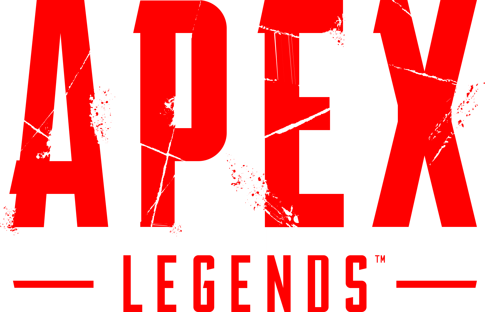

> This project is still missing one crucial piece of code and should be fixed within 24 hours. -This message written Monday, June 14, 2021 8:08PM(ADT)

<h1>Apex Legend Tracker</h1>

> Note: This is my Full-stack project for my final project for my Concordia University Web development Bootcamp. This project took me 7 days to accomplish and there are still some things to do but the heavy lifting is mostly done. This project uses tracker.gg/developers API to track over 13 million players for the game called Apex Legends.

> Note: This project is still under development which means sometimes it might go down for maintenance. But do not worry everything is saved into MongoDB so nothing will be lost.

> Note: When looking up someone's profile on steam/origin, the origin name should always be used since a steam name won't work.

---

## What is Apex Tracker?

Apex Tracker is a website for people to see stats on their Game profile or others. This website also features a Legend Randomizer which randomizes which legend and weapon you should play in the game. This is really good for new players who wish to discover new things and save their configuration on their profiles.

---

## Where does the player data come from?

The player data come from tracker.gg/developers API that uses EA services to access overs 13 million players playing this game across the PlayStation Network, the Xbox Network, and every player on origin/steam.

---

## How does the login works and where does my info go?

The login method provided on the website is from Auth0 Authentication Method. this is a really safe way to register on the website as none of your data is a risk or anything. After successful signup, you will have access to your profile and edit your username and save your randomized config.

---

## How to run locally?

This website source code is available to anyone who wishes to use it. here is some step to get everything started.

First thing first your should Fork this project then clone it into your IDE.

After the cloning is done you will see 2 folders which are Client and Server.

> To install all dependencies please cd into each folder and do yarn install or npm install.

After all dependencies are installed you are mostly set, the only items missing are the .env file.

> The client folder contains a file called .env in the root. In this file, you will have your EmailJS API key and also your Auth0 Client ID and domain Key.

The .env file should contain these 3 items in it, Note that where <info: something here> is written it should be replaced by your API from EmailJS or Auth0, and these <> should be deleted.

> REACT_APP_EMAILJS_API_KEY=<info: EmailJS API Key>

> REACT_APP_AUTH0_DOMAIN=<Info: Auth0 Domain>

> REACT_APP_AUTH0_CLIENT_ID=<Info: Auth0 Client ID>

Now that the frontend is settled let's hop into the backend. as for the backend, there is also a .env file that needs to be completed.

> Create a new file which is called config.env

After this file is created it should contain the following line to add your tracker.gg/developers API and MongoDB API

> TRACKER_API_URL=<Info: Tracker API URL>

> TRACKER_API_KEY=<Info: Tracker API Key>

> MONGO_URI=<Info: Mongo URI>

After all of the above done, everything is ready! to start the frontend and backend cd into each of them and run these commands.

> For frontend = yarn start or npm start

> For Backend = yarn start:server or npm start:server

---

## to-do

> Make the website better for the mobile version.

> Add more feature along the way.

---

## API

All API Endpoint will be listed below.

> Get - /api/v2/profile/:platform/:gamertag

> Get - /random/legend

> Get - /random/firearmone

> Get - /random/firearmtwo

> Get - /mongo/:userEmail

> Post - /mongo/add/:userEmail/:SelectedLegend/:SelectedPrimary/:SelectedSecondary

> Patch - /mongo/username/:userEmail/:username

> Delete - /mongo/delete/:id

---

## Contributions

Contribution is welcome to make this website better. If you have any idea of contribution you wish to make please don't hesitate to contact me so we can talk about it.

## License

[MIT](https://choosealicense.com/licenses/mit/)
